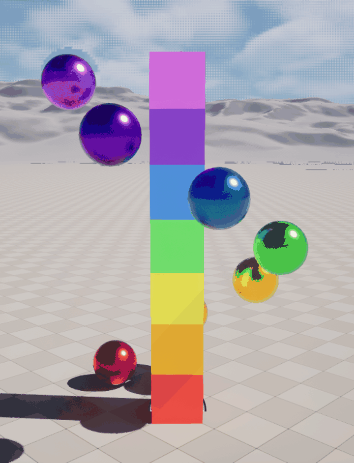

# Unreal MCP Tester

**Experiment:** How much of an Unreal project can Claude Code build
using Unreal Engine 5.8's experimental MCP integration using only
conversational prompts?

A small Unreal Engine **5.8** playground built while experimenting with
Unreal's **experimental Model Context Protocol (MCP)** support.

The project was created collaboratively with Claude Code using MCP to
drive the Unreal Editor. Almost everything in the project was
AI-generated, with one notable exception: the Blueprint graph. While
Claude produced a fully functional Blueprint, I spent a few minutes
reorganizing the graph into something a human could actually read.

You don't need MCP to open or play with this project---it works
perfectly well as a standalone Unreal project---but it's a compact
example of what an MCP-enabled AI assistant can build inside the editor.

This is a **Blueprint-only** project. There is no C++ source.

------------------------------------------------------------------------

## Demo

A full revolution of the sphere tornado: seven metallic rainbow spheres
spiraling around the rainbow cube tower. This GIF was captured directly
from the editor through MCP. 

------------------------------------------------------------------------

## Purpose

This project exists purely as an experiment.

Rather than building a game, the goal was to see how well an AI
assistant could control Unreal Editor through MCP---creating assets,
spawning and arranging actors, building materials, manipulating a level,
and generating Blueprint logic.

Unreal Engine 5.8 ships with an experimental **ModelContextProtocol**
plugin that exposes editor functionality over MCP. With the plugin
enabled, an MCP client (Claude Code in this case) can connect to a
running editor instance and issue tool calls that modify the project
directly.

------------------------------------------------------------------------

## What's in here

-   **`MCPTestMap`** --- the test level used for the experiments.
-   **`Content/StackedCubes/`** --- assets generated during the
    experiments, including:
    -   `BP_SphereTornado` --- the Blueprint actor responsible for the
        animation.
    -   `M_CubeColor` --- the base material, along with a collection of
        colored material instances (`MI_Red`, `MI_Blue`, `MI_Green`,
        etc.) and their metallic counterparts (`MI_*Metal`).

------------------------------------------------------------------------

## Prompts

These are the prompts I gave Claude, in order.

I intentionally didn't start with a detailed design document. The goal
was simply to explore what MCP could do, starting with vague requests
and gradually becoming more specific as ideas came to mind.

-   **Create 5 different colored cubes stacked on top of each other.**
    -   **Result:** Success.
-   **Make a tower of spheres next to the tower of cubes. The tower
    should be the same height and the spheres the same colors as the
    cubes, but make them metallic.**
    -   **Result:** Success.
-   **Add Blueprint logic to make the spheres spiral around the cube
    tower. Each sphere should stay in its current horizontal plane, move
    at the same speed, and remain evenly spaced from the others. The
    effect should look like a slow tornado around the cube tower. It
    should start when I press the `G` key and stop when I press `G`
    again.**
    -   **Result:** Almost. The Blueprint worked, but the sphere mesh
        components were created with **Static** mobility, so Unreal
        wouldn't allow them to move at runtime. After I gave Claude the
        runtime error message, it switched them to **Movable**, and
        everything behaved exactly as I had intended.
-   **It looks good, but when I press Play the tower is behind me. I'd
    like to start a short distance away so the entire effect fits in
    view.**
    -   **Result:** Success.
-   **The cubes look really flat and two-dimensional, like they aren't
    responding to any light source. What are some options for making
    them more interesting?**
    -   **Result:** Claude experimented with the lighting, but I didn't
        notice much difference. The real issue was that I was looking
        perfectly square-on at the cubes, so they genuinely looked like
        flat colored squares.
-   **It looks the same.**
    -   **Result:** Claude took screenshots, interpreted my rather vague
        complaint, and rotated the cubes about 45 degrees. That was
        exactly what I was trying to describe.
-   **My son says it needs a full rainbow, so we need seven colors for
    both the cubes and the spheres.**
    -   **Result:** Success. Full rainbow, in order.

------------------------------------------------------------------------

## Review

Overall, Claude did a surprisingly good job.

It consistently produced sensible results from fairly open-ended prompts
and was even better when given more specific instructions. The only
functional mistake came during the Blueprint animation, where the
generated components were marked as **Static** instead of **Movable**.
Once I supplied Unreal's error message, Claude immediately identified
the issue and fixed it.

The generated Blueprint graph, however, was another story. It was fully
functional but a complete tangle. Fortunately it wasn't very large, and
I was able to reorganize it into something a human could actually read
in about five minutes.

------------------------------------------------------------------------

## Conclusion

Getting this running was surprisingly easy, and the experiment was a lot
of fun.

Claude Code isn't particularly fast, so expect to find something else to
do while it's working. On the other hand, it's genuinely satisfying to
watch new assets, materials, and actors appear in the Content Browser
while the AI is building your project.

For a first look at Unreal's experimental MCP support, I came away
impressed. There's still plenty of room for improvement, but the ability
to let an AI directly manipulate an open Unreal project feels like a
meaningful step toward a much more interactive development workflow.

------------------------------------------------------------------------

## MCP Setup

The MCP connection is configured in `.mcp.json`.

### Requirements to experiement with MCP (not required to try out the tester)

-   Unreal Engine **5.8**
-   **ModelContextProtocol** plugin enabled
-   Editor tooling plugins configured in the project

### Running

1.  Open `Tester.uproject`.
2.  Verify the MCP server is running.
3.  Connect Claude Code (or another MCP client).
4.  Start issuing tool calls against `MCPTestMap`.

------------------------------------------------------------------------

## Status

**Experimental.**

This repository exists to explore Unreal's experimental MCP integration,
not to demonstrate Unreal best practices or ship a finished project.
Expect rough edges, AI-generated oddities, and the occasional Blueprint
graph that needed a little human intervention.
